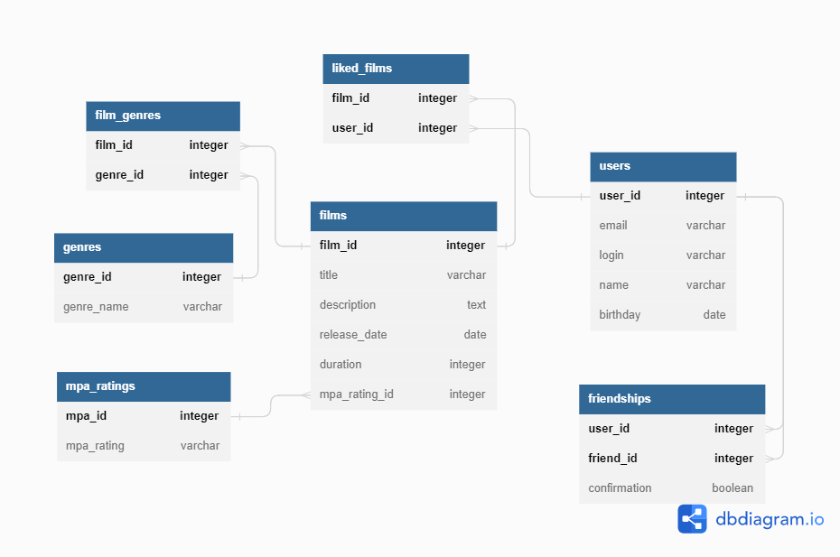

# java-filmorate
Repository of Yandex Practicum project "Filmorate".
## База данных
В проекте используется реляционная база данных PostgreSQL. Структура базы данных отображена на [ER-диаграмме](https://dbdiagram.io/d/644834716b3194705130348e).

**films**
Содержит данные о фильме.
- первичный ключ *film_id* - идентификатор фильма;
- *title* - название фильма;
- *description* - описание фильма (не более 200 символов);
- *release_date* - дата релиза фильма;
- *duration* - продолжительность фильма;
- внешний ключ *mpa_rating_id* (ссылается на таблицу **mpa_ratings**)- рейтинг Ассоциации кинокомпаний.

**film_genres**
Содержит данные о жанрах, к которым относится фильм.
- внешний ключ *film_id* (ссылается на таблицу **films**) - идентификатор фильма;
- внешний ключ *genre_id* (ссылается на таблицу **genres**) - идентификатор жанра.

**genres**
Содержит название жанров.
- первичный ключ *genre_id* - идентификатор жанра;
- *name* - название жанра.

**mpa_ratings**
Содержит названия рейтингов Ассоциации кинокомпаний.
- первичный ключ *mpa_id* - идентификатор рейтинга;
- *mpa_rating* - категория рейтинга.

**favorite_films**
Содержит информацию о лайках, поставленных фильму.
- внешний ключ *film_id* (ссылается на таблицу **films**) - идентификатор фильма;
- внешний ключ *user_id* (ссылается на таблицу **users**) - идентификатор пользователя.

**users**
Содержит данные пользователя.
- первичный ключ *user_id* - идентификатор пользователя;
- *email* -почта пользователя;
- *login* - логин пользователя;
- *name* - имя пользователя;
- *birthday* - день рождения пользователя.

**friendships**
Содержит информацию о дружбе пользователей.
- внешний ключ *user_id* (ссылается на таблицу **users**) - идентификатор пользователя;
- внешний ключ *friend_id* (ссылается на таблицу **users**) - идентификатор друга;
- *confirmation* - статус дружбы: подтверждена или не подтверждена другом.
